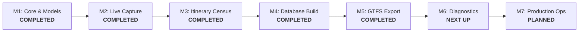

# Pipeline Milestones & Implementation Roadmap

This document tracks the phased implementation milestones for the Open-KRL pipeline based on the architecture, invariants, and DAG contracts specified in [`design.md`](../design.md).

---

## High-Level Status Overview

| Milestone | Stage / Area | Key Artifacts & Contracts | Status |
| :--- | :--- | :--- | :---: |
| **Milestone 1** | Foundation & Storage | Data models, Drizzle SQLite schemas, hash engines, calendar/time core | ✅ **Completed** |
| **Milestone 2** | Stage 1 Capture (`krl capture`) | Raw snapshot boards, Gates 1 & 2 drift checks, manifest, git commits | ✅ **Completed** |
| **Milestone 3** | Stage 2 Census (`krl census`) | Stratified spot-checks, resumable crawler, multi-observation envelopes | ✅ **Completed** |
| **Milestone 4** | Stage 3 Build (`krl build`) | Pure functional fold, 13 invariants, topological fallback, SQLite WAL DB | ✅ **Completed** |
| **Milestone 5** | Stage 4 Export (`krl export`) | GTFS spec CSVs, release gates, validation report, zip packaging | ✅ **Completed** |
| **Milestone 6** | Diagnostic Tooling | Out-of-DAG tools: `krl calendar` (diff report) and `krl detect` (live probe) | 🟡 **Next Up** |
| **Milestone 7** | Automation & Hardening | CI/CD test automation, scheduled cron captures, release distribution | ⚪ Planned |

---

## Detailed Milestone Progress

### Milestone 1: Foundation, Schemas & Domain Core ✅
- [x] **Zod Schemas:** API and archive contracts (`src/api/schemas.ts`, `src/archive/schemas.ts`).
- [x] **Relational Schema:** SQLite DDL via Drizzle ORM with `STRICT` mode, foreign keys, and indexes (`src/db/tables.ts`).
- [x] **Deterministic Hashing:** SHA-256 station master and board response hash computation (`src/archive/hashes.ts`).
- [x] **Calendar & Service Day:** WIB timezone handling, day-type classification, and holiday parser (`src/core/calendar.ts`, `src/db/holidays.ts`).
- [x] **Time Arithmetic:** Integer service-day seconds conversion supporting early-morning wrap-around and dead-band detection (`src/core/time.ts`).
- [x] **Train ID Grammar:** Extraction of base train numbers, revision letters, and fakultatif flags (`src/core/trainid.ts`).
- [x] **Route Normalization:** Station code and destination resolution (`src/core/route.ts`).
- [x] **Git Isolation:** Atomic snapshot and envelope commit sandboxing (`src/core/git.ts`).
- [x] **Test Baseline:** Unit tests covering core arithmetic, hashing, and schemas.

---

### Milestone 2: Stage 1 Live Capture Pipeline (`krl capture`) ✅
- [x] **Station Roster Harvester:** Active station list retrieval with station code defect mapping (`GGL` $\to$ `GRG`).
- [x] **Concurrent Departure Harvester:** Station board scraper with rate limiting and exponential backoff retry.
- [x] **Gate 1 Validation:** Station master hash stability check against existing same-day snapshots.
- [x] **Gate 2 Validation:** Board response hash comparison to detect schedule edition mutations before writing to disk.
- [x] **Raw Storage Layout:** Structured storage under `data/raw/<version>/captures/<id>/` with `manifest.json`.
- [x] **Automated Git Commits:** Strict directory-contained commit generation with metadata summaries and co-author attribution.
- [x] **Snapshot Discovery:** Version and snapshot discovery utilities (`src/capture/snapshots.ts`).
- [x] **CLI Command:** `krl capture [version]` with confirmation prompts and `--new-version` flag.

---

### Milestone 3: Stage 2 Itinerary Census Pipeline (`krl census`) ✅
- [x] **Train Discovery:** Comprehensive train ID extraction across station departure boards.
- [x] **Stratified Spot-Check:** Fast pre-check probing 5 representative corridor services to detect hash divergence before full crawl.
- [x] **Incremental & Resumable Scraper:** Network crawl querying only unprobed itineraries, caching raw envelopes atomically under `data/raw/<version>/itineraries/<train_id>.json`.
- [x] **Multi-Observation Envelopes:** Preservation of day-type specific observations (`weekday`, `saturday`, `sunday`, `holiday`).
- [x] **Release Gate:** Pre-condition check enforcing that a completed capture snapshot exists for the target day type.
- [x] **CLI Flags:** `krl census [version]` with `--reprobe-all` and `--day-type <type>`.
- [x] **Automated Git Commits:** Atomic commits recording probed trip tallies and run metadata.

---

### Milestone 4: Stage 3 Database Build Pipeline (`krl build`) ✅
- [x] **Raw Archive Loader:** In-memory loading of raw committed snapshots, station coordinates, holidays, and itinerary envelopes (`src/build/load.ts`).
- [x] **Pure Functional Fold:** In-memory reduction into normalized relational entities without side-effects (`src/build/fold.ts`).
- [x] **13 Railway Physical Invariants:** Implementation and strict enforcement in `src/build/invariants.ts`:
  - Inv 1: Intra-trip attribute consistency across departure boards.
  - Inv 2: Minimum board occurrence count ($\ge 2$).
  - Inv 3: Dead band departure detection (01:30–03:30).
  - Inv 4: Board-itinerary time congruence ($\pm 60$s rounding tolerance).
  - Inv 5: Terminus station and arrival time alignment.
  - Inv 6: Strict stop sequence service-day second monotonicity.
  - Inv 7: Train ID canonical grammar validation.
  - Inv 8: Suffix transition progression.
  - Inv 9: Station referential integrity against catalog.
  - Inv 11: Cross-snapshot station master and board hash edition consistency.
  - Inv 12: Cross-capture trip attribute conflict isolation.
  - Inv 13: Board appearance vs. itinerary stop count congruence.
- [x] **Topological Board Reconstruction:** Defensive fallback reconstructing stop chronologies from board departures when itineraries are absent (`src/build/reconstruct.ts`).
- [x] **SQLite Persistence:** Atomic transaction persistence with WAL mode, foreign keys, and batch prepared statements (`src/build/persist.ts`).
- [x] **Defective Entity Isolation:** Quarantine table (`quarantined_trips`) isolating deadhead runs, regional diesel trains, and malformed records.
- [x] **Upstream Anomaly Resolvers:**
  - KAI Commuter Sept 1, 2026 Karet (`KAT`) $\to$ BNI City (`SUDB`) operational diversion mapping and investigation documentation (`docs/anomalies/karet-bni-city-diversion.md`).
  - Tanjung Priok / Priuk spelling variant normalization and `VIA ...` bypass suffix cleaning.
- [x] **CLI Command:** `krl build [version]` with options for db paths, version checks, and build statistics.

---

### Milestone 5: Stage 4 GTFS Export Pipeline (`krl export`) ✅
- [x] **Task 5.1: Export Architecture & Data Contracts**
  - Define export options, GTFS configuration types, and progress reporter interfaces in `src/export/types.ts`.
- [x] **Task 5.2: GTFS Specification Mappers (`src/export/tables/`)**
  - `agency.txt`: Kereta Commuter Indonesia (KCI) feed metadata (`agency_id`, `agency_name`, `agency_url`, `agency_timezone`, `agency_lang`).
  - `stops.txt`: Station codes (`sta_id`), localized station names, and coordinates mapped from `data/station_coordinates.csv`.
  - `routes.txt`: Commercial transit lines derived from `ka_name` (e.g. Commuter Line Bogor, Cikarang) with route colors.
  - `trips.txt`: Service keys, route associations, `trip_headsign`, and directional identifiers.
  - `stop_times.txt`: Continuous service-day second formatting (`HH:MM:SS` and `24:XX:XX` for post-midnight runs), stop sequences, pickup/drop-off types.
  - `calendar.txt`: Recurring weekly service intervals derived directly from `trip_calendar` presence masks (conservative masks under provisional state).
  - `calendar_dates.txt`: Date-specific overrides; statutory national holiday service removals (`exception_type = 2`) for fakultatif trains.
- [x] **Task 5.3: Production Release Gates**
  - `--require-resolved-calendar`: Enforce all 3 day types (`weekday`, `saturday`, `sunday`) are present and `calendar_state = 'resolved'`.
  - `--require-census-complete`: Assert zero discovered trips remain with unprobed itineraries.
  - `--require-holiday-coverage`: Verify feed validity horizon does not extend past covered holiday decrees in `data/holidays.json`.
- [x] **Task 5.4: Packaging & Checksums**
  - Stream CSV generation into standard ZIP archive (`krl_gtfs_v<version>.zip`).
  - Generate SHA-256 feed digest for release validation.
- [x] **Task 5.5: CLI Integration & Summary Report**
  - Implement `krl export [version]` command in `src/cli.ts` with output directory options, summary metrics, and audit reporting.
- [x] **Task 5.6: Test Suite**
  - Unit tests for GTFS field formatters, time stringifiers (`24:XX:XX`), and calendar mask transformers.
  - End-to-end integration tests validating generated ZIP against the official GTFS specification rules.

---

### Milestone 6: Operational & Diagnostic Tooling ⚪ (Planned)
- [ ] **Task 6.1: `krl calendar` (Out-of-DAG Empirical Inspection Tool)**
  - Three-way set-difference report across `weekday`, `saturday`, and `sunday`.
  - Identity breakdown identifying shared base schedules vs. weekend/fakultatif augmentations.
- [ ] **Task 6.2: `krl detect` (Out-of-DAG Operational Drift Probe)**
  - 3-station live departure probe (Manggarai, Bekasi, Rangkasbitung) covering central trunk, eastern trunk, and western branch lines.
  - Automated comparison against active SQLite database filtered for today's active day type (`trip_calendar[day_type] == 1`).
  - Rapid (<15s) execution for automated cron or ad-hoc operator verification.

---

### Milestone 7: Production Hardening & CI/CD ⚪ (Planned)
- [ ] **Task 7.1: Continuous Integration Workflows**
  - GitHub Actions verifying type safety (`tsc --noEmit`), lint/formatting (`biome check`), and unit/integration tests (`bun test`).
- [ ] **Task 7.2: Scheduled Pipeline Cron Workflows**
  - Automated recurring `capture` and `census` workflows with operational alerting on hash divergence.
- [ ] **Task 7.3: Distribution & Releases**
  - GitHub Releases publishing compiled SQLite database (`krl_v<version>.db`) and validated GTFS package (`krl_gtfs_v<version>.zip`).
