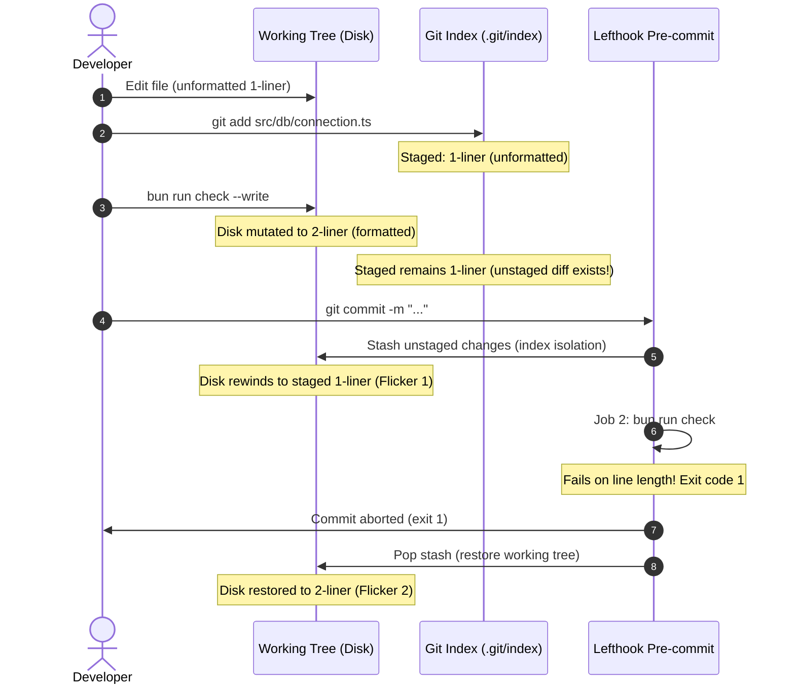

# Tooling Post-Mortem: Lefthook Piped Execution Deadlock & Stash Flicker

## Executive Summary

During pre-commit execution on a branch containing database connection fixes, Git rejected the commit with a formatting error. Paradoxically, the file in the working tree appeared compliant before and immediately after the failed commit attempt, yet momentarily reverted to an unformatted state during execution.

Investigation identified an execution order deadlock within `lefthook.yml` combined with Git index isolation stashing. A non-mutating check command (`biome check`) ran before the auto-formatting step (`biome format --write`), causing `piped: true` execution to terminate prematurely and starving `stage_fixed: true` from ever executing.

---

## 1. Incident Chronology & Mechanical Lifecycle

The apparent "flickering" of the target file (`src/db/connection.ts`) resulted from a desynchronization between Git's staging index and the working tree, interleaved with Lefthook's index isolation lifecycle.



### Detailed Event Trace
1. **Initial Stage:** The developer staged an unformatted one-line change into the Git index.
2. **Manual Out-of-Band Formatting:** The developer executed `bun run check --write` via the terminal. Biome correctly wrapped the statement across two lines in the working directory. However, the modified file was **not re-staged** with `git add`. The Git index still held the unformatted one-liner.
3. **Index Isolation (Stash):** Upon invoking `git commit`, Lefthook isolated the staged index by stashing all unstaged working directory changes. The file on disk was temporarily rewound to match the unformatted staged index.
4. **Premature Piped Abort:** Lefthook executed Job 2 (`bun run check`). Because `biome check` enforces line length formatting rules in addition to linting, it detected the unformatted line, threw an error, and exited with status code `1`.
5. **Stash Restoration:** Because the pre-commit hook aborted, Lefthook restored the stashed working directory modifications, returning the compliant two-line formatting to the developer's editor.

---

## 2. Root Cause Analysis

### A. Semantic Mismatch (`lint` vs `check`)
The pre-commit configuration defined a job labeled `lint` that executed `bun run check`:
```yaml
- name: lint
  glob: "*.{js,ts,cjs,mjs,jsx,tsx,json,jsonc,css,graphql}"
  exclude: "(^data/|^tests/fixtures/)"
  run: bun run check
```
In Biome, `biome check` evaluates both linting diagnostics and code formatting constraints. By executing `check` rather than `biome lint`, the job acted as a strict formatting validator before the dedicated formatting job had an opportunity to run.

### B. Inverted Pipeline Order & Dead-on-Arrival Formatter
The pipeline arranged verification before auto-formatting:
```yaml
pre-commit:
  parallel: false
  piped: true
  jobs:
    - name: typecheck
      run: bun run typecheck
    - name: lint
      run: bun run check          # Halts here on format error!
    - name: format
      run: bun run format {staged_files}
      stage_fixed: true           # Starved from execution
```
Because `piped: true` halts the pipeline upon encountering the first non-zero exit code, Job 2 aborted the commit immediately upon seeing unformatted code. Job 3 (`format` + `stage_fixed: true`) was rendered unreachable whenever unformatted code was staged.

### C. Git Staging Non-Atomicity
Pre-commit hook frameworks do not provide database-like ACID rollback semantics. Files altered by tools during pre-commit remain altered on disk. When unstaged changes are present in files being validated, stashing and stash restoration create perceptual confusion if the developer assumes the hook modified the file on disk.

---

## 3. Remediation & Architectural Invariants

### 1. Invariant: Mutating Operations Must Precede Verification
In any hook pipeline that permits automated fixes, all mutating operations (`--write` + `stage_fixed: true`) must execute at the front of the pipeline. Non-mutating verification steps (`typecheck`, integration tests) must execute exclusively against the post-mutation artifact.

### 2. Consolidated Biome Pre-Commit Job
The three separate jobs (`typecheck`, `lint`, `format`) were consolidated into a single two-stage pipeline in `lefthook.yml`:

```yaml
pre-commit:
  parallel: false
  piped: true
  jobs:
    - name: auto-fix
      glob: "*.{js,ts,cjs,mjs,jsx,tsx,json,jsonc,css,graphql}"
      exclude: "(^data/|^tests/fixtures/)"
      run: bun run check --write {staged_files}
      stage_fixed: true

    - name: typecheck
      run: bun run typecheck
```

This guarantees that:
- Any formatting or safe lint violations in staged files are repaired and staged before verification.
- `typecheck` evaluates the exact syntax and structure that will enter the Git history.
- The execution order deadlock is structurally impossible.
